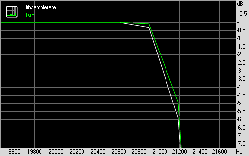
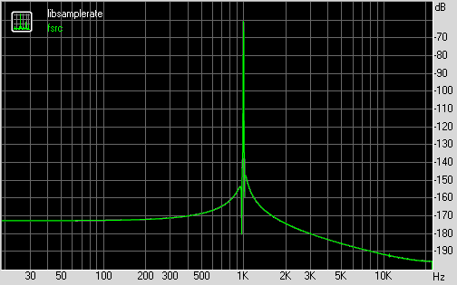
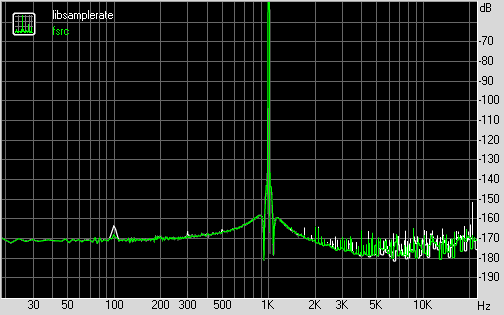
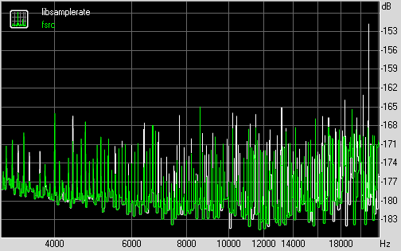
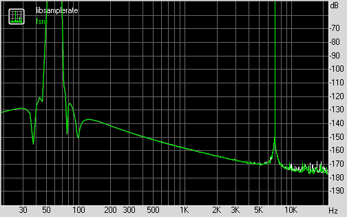
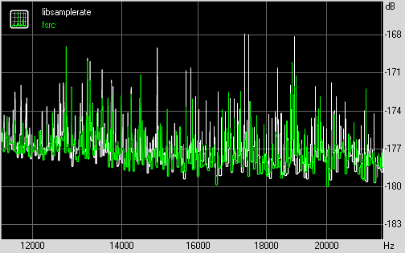

<h1 align="center">FSRC - A sample rate conversion library</h1>

Specifically, it aims to provide:
<ul>
<li>Flexible API</li>
<li>Fast filter design using actual optimization algorithms (instead of the ubiquitous Kaiser window)</li>
<li>Good performance without compromising quality</li>
<li>Incorporation of low-delay requirements</li>
</ul>
At this stage it is not feature complete and existing features are not debugged.

<h2>The details</h2>

Linear phase FIR filters are currently designed using Lawson's algorithm with weight update envelopes (see <a href="http://www.spsoc.ntu.edu.sg/limyc/SP/1992_wls.pdf">A weighted least squares algorithm for quasi-equiripple FIR and IIR digital filter design</a>).
The filters it produces are nearly optimal in the minimax sense (It can also be modified for least squares stopbands - see <a href="http://www.nt.tuwien.ac.at/fileadmin/users/gerhard/diss_Lang.pdf">this</a>). While not strictly elegant, it has the advantage that each iteration requires the solution of a Toeplitz system of linear equations and a couple of FFTs. The linear systems are solved quickly using preconditioned conjugate gradient.

While comparably fast, filter design using this method can still take a couple of seconds at high quality settings, therefore FSRC is able to store the designs for later re-use, so it becomes a one-time effort.
For this purpose, the included test program uses the %APP_DATA%\fsrc directory on Windows and ~/.libfsrc on *NIX.

Currently, FSRC implements the usual polyphase rate conversion, as well as frequency domain resampling which, assuming a conversion factor of L/M, boils down to:
<ul>
<li>compute the DFT of an input block</li>
<li>periodically extend the transform L times (equivalent to zero stuffing in the time domain)</li>
<li>apply the filter (pointwise multiplication)</li>
<li>divide the spectrum into M parts and add them together (equivalent of decimation in the time domain)</li>
<li>compute inverse DFT</li>
</ul>
The downside is that the transforms sizes need to be of the form K*M and K*L respectively for the input and output, where K is an arbitrary positive integer. The rest is the same as in the usual block filtering. For optimal performance, a careful adjustment of the buffer sizes is required. This is not currently done, so the performance of this method should improve in the future.

AFAIK, FSRC is also the only library which is able to perform optimal multistage decomposition of arbitrary (sans prime) conversion ratios on the fly.

<h2>Performance</h2>

As a teaser, this readme will present a tiny comparison to <a href="http://www.mega-nerd.com/SRC/">libsamplerate</a>. It might not be entirely fair, since libsamplerate allows time-varying conversion factors, while FSRC does not (yet, at least).
Still, libsamplerate seems to be the only library which is both high-quality and has a decent programming interface. I'll try to add a couple more into the mix later (like SOX).

For the comparison, I've tried to use settings that match libsamplerate's best quality converter. <a href="http://audio.rightmark.org/">RMAA</a> was used to compare the quality - the 44.1kHz test signal was resampled to 96kHz and back. I've finally settled on the following:
<ul>
<li>Peak-to-peak passband ripple of 0.0001dB</li>
<li>Stopband attenuation of 166dB</li>
<li>Preserve 94% of bandwith below the Nyquist rate</li>
</ul>
Those were the specs fed into the API. The actual design might slightly exceed this spec.

The results produced were as follows: 

<h1 align="center">libsamplerate 
fsrc 
</h1>
<h2 align="center">RightMark Audio Analyzer test</h2> 
<h4 align="center">Testing chain:  
Sampling mode: 32-bit, 44 kHz  
</h4>   
<h3 align="center">Summary</h3>
<table align="center" width="600" cellspacing="0" cellpadding="3" border="1">
<tr align="center" bgcolor=#C0C0C0>
<td><strong>Test</strong></strong></td><td><strong>libsamplerate</strong></td><td><strong>fsrc</td></tr>
<tr align="center">
<td bgcolor=#C0C0C0 align="left"><strong>Frequency response (from 40 Hz to 15 kHz), dB:</strong></td>
<td>+0.00, -0.00</td><td>+0.00, -0.00</td></tr>
<tr align="center">
<td bgcolor=#C0C0C0 align="left"><strong>Noise level, dB (A):</strong></td>
<td>-194.1</td><td>-210.8</td></tr>
<tr align="center">
<td bgcolor=#C0C0C0 align="left"><strong>Dynamic range, dB (A):</strong></td>
<td>133.2</td><td>133.2</td></tr>
<tr align="center">
<td bgcolor=#C0C0C0 align="left"><strong>THD, %:</strong></td>
<td>0.0000</td><td>0.0000</td></tr>
<tr align="center">
<td bgcolor=#C0C0C0 align="left"><strong>IMD + Noise, %:</strong></td>
<td>0.0002</td><td>0.0002</td></tr>
<tr align="center">
<td bgcolor=#C0C0C0 align="left"><strong>Stereo crosstalk, dB:</strong></td>
<td>-194.5</td><td>-213.2</td></tr>
</table>
   <h3 align="center">Frequency response</h3>

 <h3 align="center">Dynamic range</h3>

 <h3 align="center">THD + Noise (at -3 dB FS)</h3>

 <h3 align="center">THD Closeup</h3>

 <h3 align="center">Intermodulation distortion</h3>

 <h3 align="center">IMD Closeup</h3>

&nbsp;

